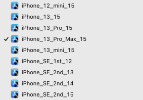

# XcrunSimctlTestNotes

## Contents <a id="contents"></a>
[Section](#section-) •
[Resources](#resources-)

## Section <a id="section-"></a><sup>[▴](#contents)</sup>

**Step 1. Setup Environment Variables**

Setup the machine specific environment variables in the appropriate resources file such as `~/.zshrc` or `$HOME/.bash_profile`. Edit simulator names in Xcode to replace spaces with underscore and append the major ios version to the name. For example, "iOS 15.2, iPhone 8" becomes `iPhone_8_15` and "iOS 14.5, iPad Pro (11-inch) (3rd generation)" becomes `iPad_Pro_11in_3rd_14`. Replace `Xʀ` with `Xr`



_list devices_

``` sh
# xcrun simctl delete unavailable
xcrun simctl list devices
```

_regex find & replace_

``` regex
   Find: ^[ ]*([^ ]*)[ (]*([^)]*).*
Replace: export UUID_$1="$2"
```

_`~/.zshrc`_

``` sh
###
### XCRUN SIMCTL: SIMULATOR DEVICE UUIDs
###
# ...
export UUID_iPhone_13_15="4A0A9B73-0A6E-4182-9613-7184022EC4F6"
export UUID_iPhone_13_mini_15="59B39458-A7F2-4E5D-AFE8-54788EF8E8AF"
export UUID_iPhone_13_Pro_15="63081D25-20AE-4A46-8097-991ECEB5FCAB"
export UUID_iPhone_13_Pro_Max_15="D61EF1F2-FEAE-4C29-9BF6-21F408C22CCE"
```

**Step 2. Reset Device State**

``` sh
#xcrun simctl erase DEVICE_UUID
xcrun simctl erase $UUID_iPhone_13_Pro_Max_15
```

**Step 3. Set Device Language (Region)**

> Approach: Using `plutil` to modify the region settings for a specific simulator.

| Langauge (Region)     | AppleLanguages | AppleLocale |
|-----------------------|----------------|-------------|
| English (US)          | en-US          | en_US       |
| German (Germany)      | de-DE          | de_DE       |
| Hebrew (Israel)       | he-IL          | he_IL       |
| Portuguese (Brazil)   | pt-BR          | pt_BR       |
| Portuguese (Portugal) | pt-PT          | pt_PT       |
| Russian (Russia)      | ru-RU          | ru_RU       |
| Spanish (Spain)       | es-ES          | es_ES       |

_$HOME/Library/Developer/CoreSimulator/Devices/UUID_DEVICE/data/Library/Preferences/.GlobalPreferences.plist_

``` xml
<key>AppleLanguages</key>
<array>
    <string>es-ES</string>
</array>
<key>AppleLocale</key>
<string>es_ES</string>
<array>
    <string>es_ES@sw=QWERTY-Spanish;hw=Automatic</string>
    <string>en_US@sw=QWERTY;hw=Automatic</string>
    <string>emoji@sw=Emoji</string>
    <string>de_DE@sw=QWERTZ-German;hw=Automatic</string>
    <string>he_IL@sw=Hebrew;hw=Automatic</string>
    <string>pt_BR@sw=QWERTY;hw=Automatic</string>
    <string>pt_PT@sw=QWERTY;hw=Automatic</string>
    <string>ru_RU@sw=Russian;hw=Automatic</string>
    <string>ru_RU@sw=Russian-Phonetic;hw=Automatic</string>
</array>
```

_`~/.zshrc` setup_

``` sh
###
### DEVICE PREFERENCES LIST (plist)
###
SIM_DEVICE_DIR="$HOME/Library/Developer/CoreSimulator/Devices"
SIM_DEVICE_PREFS="data/Library/Preferences/.GlobalPreferences.plist"

function devicePrefsPath() {
    echo "$SIM_DEVICE_DIR/$1/$SIM_DEVICE_PREFS"
}

## set region
## example: setDeviceRegion  $UUID_iPhone_12_15 "en"
function setDeviceRegion() {
    ## $1 - device uuid
    ## $2 - device region
    prefsPath="$SIM_DEVICE_DIR/$1/$SIM_DEVICE_PREFS"
    plutil -replace AppleLocale -string "$2" "$prefsPath"
}

## set language
## example: setDeviceLanguage $UUID_iPhone_12_15 "en" 
function setDeviceLanguage() {
    ## $1 - device uuid
    ## $2 - device language
    prefsPath="$SIM_DEVICE_DIR/$1/$SIM_DEVICE_PREFS"
    plutil -replace AppleLanguages -json "[ \"$2\" ]" "$prefsPath" 
}
```

_check: preferences path_

> Note: The simulator devices needs to have beenn launched once for the `.GlobalPreferences.plist` to be present.

``` sh
## Uses $() function command syntax
prefsPath=$(devicePrefsPath $UUID_iPhone_13_Pro_Max_15)  
echo $prefsPath
# -p  print the property list in a human-readable fashion.
plutil -p "$prefsPath"
```

_check: set Spanish then launch_

``` sh
devicePrefsPath $UUID_iPhone_13_Pro_Max_15
xcrun simctl shutdown $UUID_iPhone_13_Pro_Max_15

setDeviceLanguage $UUID_iPhone_13_Pro_Max_15 "es-ES"
setDeviceRegion   $UUID_iPhone_13_Pro_Max_15 "es_ES"

xcrun simctl boot $UUID_iPhone_13_Pro_Max_15
```

_check: set Hebrew then launch_

``` sh
devicePrefsPath $UUID_iPhone_13_Pro_Max_15
xcrun simctl shutdown $UUID_iPhone_13_Pro_Max_15

setDeviceLanguage $UUID_iPhone_13_Pro_Max_15 "he-IL"
setDeviceRegion   $UUID_iPhone_13_Pro_Max_15 "he_IL"

xcrun simctl boot $UUID_iPhone_13_Pro_Max_15
```

_check: set English then launch_

``` sh
devicePrefsPath $UUID_iPhone_13_Pro_Max_15
xcrun simctl shutdown $UUID_iPhone_13_Pro_Max_15

setDeviceLanguage $UUID_iPhone_13_Pro_Max_15 "en-US"
setDeviceRegion   $UUID_iPhone_13_Pro_Max_15 "en_US"

xcrun simctl boot $UUID_iPhone_13_Pro_Max_15
```

**Step 4. Run Device Test**

## Resources <a id="resources-"></a><sup>[▴](#contents)</sup>

* [Using iOS Simulator with the Command Line ⇗](https://notificare.com/blog/2020/05/22/Using-iOS-Simulator-with-the-Command-Line/) has command line approach for setting the simulator language and region via `plutil`.
