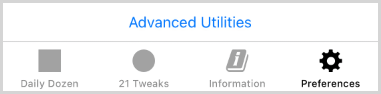

# Daily Dozen App Developer Notes

_This document provides developer notes for building and debugging the Open Source Daily Dozen app for Apple products._

Contents: <a id="contents"></a>
[Essentials](#essentials-) •
[Build](#build-) •
[Debug](#debug-)

## Essentials <a id="essentials-"></a><sup>[▴](#contents)</sup>

**Prerequisites: A working knowledge of [Apple iOS SW Development][AppleDocs], [CocoaPods][], [Git][], [GitHub][], [Swift][], [Xcode][] is required for software development.**

CocoaPods may be replaced with the [Swift Package Manager][SPM] at some future time. [Homebrew][] can be helpful to install and update supporting tools.

_Library Versions_

The 3rd party library versions currently in use are specified in [DailyDozen/Podfile](../DailyDozen/Podfile). Version notes on the 3rd party libraries in use can be found in [Docs/LibraryNotes.md](LibraryNotes.md) 

_OS Versions_

The Dozen Dozen app is implemented to support iOS 15.1 or newer iOS versions. The Daily Dozen app can be run on, and is supported on, the range of Apple OS hardware as follows: 

- Apple Watch - Currently out of scope.
- Apple TV - Out of scope.
- Apple Vision - Out of scope.
- iPhone - iOS 15.1 or later. Directly supported.
- iPad - iPadOS 15.1 or later. Indirectly supported as an iOS app 
- iPod Touch - iOS 15. Last iOS verion for iPods. Directly supported iOS.
- Mac - macOS 12.0 or later on a Mac with Apple M1 chip or later. Indirectly supported as a built-for-iOS app which happens to run on some Mac computers.

> _Note: Although the app can run on iPadOS and the newer ARM-based macOS, iOS on iPhone is the primary scope for the source code in this repository at this time._

_Software Development Tool Versions_

The latest production-release version of each software development tool is used for all development which is candidate to be distributed in Apple's App Store:

- [Apple Xcode](https://apps.apple.com/us/app/xcode/id497799835)
- [CocoaPods](https://formulae.brew.sh/formula/cocoapods)
- [SwiftLint][]

[CocoaPods][] and [SwiftLint][] can be installed and kept up-to-date via [Homebrew][].

- [cocoapods brew formula](https://formulae.brew.sh/formula/cocoapods)
- [swiftlint brew formula](https://formulae.brew.sh/formula/swiftlint)

## Build <a id="build-"></a><sup>[▴](#contents)</sup>

**Open Source Build**

The `DailyDozenOSS` scheme is used to build an open source version of the DailyDozen iOS application.


> Note: _There is a `GoogleService-Info.plist` file used for opt-in analytics which is not being distributed for open source builds. The DailyDozenOSS scheme builds without the `GoogleService-Info.plist` file._

**Apple App Store Build**

The `DailyDozenAppstore` scheme is used to build any version that is submitted to the Apple App Store for global distribution. This scheme requires the `GoogleService-Info.plist` file which is used for opt-in analytics. The value `WITH_ANALYTICS` is added to the Swift build environment variable `SWIFT_ACTIVE_COMPILATION_CONDITIONS`. The `WITH_ANALYTICS` value is used by the related `#if` … `#endif` source code sections.

``` swift
#if WITH_ANALYTICS
// Google analytics related code
#endif
```

## Debug <a id="debug-"></a><sup>[▴](#contents)</sup>

**Advanced Utilities**

There is a screen with Advanced Utilities which can be accessed through the Preferences screen for `DEBUG` builds.

``` swift
#if DEBUG
advancedUtilitiesTableViewCell.isHidden = false
// …
#endif
```



> ⚠️ **_Caution: The Advanced Utilities has several functions that can overwrite the entire Daily Dozen settings and/or database. These utilities are intended for use with the simulator or on test devices which do not contain personal Daily Dozen data. If used for devices with personal data, then first use the "Export History" to save a backup of the data._**

**Workaround: Xcode debugger breakpoints not pausing**

Xcode versions 15.1 and 15.2 were found to not pause at breakpoints for iOS 15 and iOS 16 when debugging the Daily Dozen app while using the Simulator.

Some fault isolation and internet searching confirmed that the issue was with Apple Development tools (see links below), and not issue in the Daily Dozen build/debug process.

A successful workaround has been implemented for the DailyDozen build/debug process. Workaround steps are posted in Issue #79:

- ["Xcode debugger doesn't pause at breakpoints (simulator iOS 15, 16)"](https://github.com/nutritionfactsorg/daily-dozen-ios/issues/79)

<!--  -->

[AppleDocs]:https://developer.apple.com/documentation/
[CocoaPods]:https://guides.cocoapods.org/using/using-cocoapods.html
[Git]:https://git-scm.com/doc
[GitHub]:https://docs.github.com/en/get-started/getting-started-with-git
[Homebrew]:https://brew.sh/
[SPM]:https://www.swift.org/documentation/package-manager/
[Swift]:https://www.swift.org/
[SwiftLint]:https://realm.github.io/SwiftLint
[Xcode]:https://developer.apple.com/documentation/xcode
