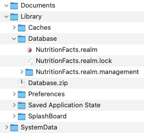

# Test Procedure Notes: v3 Database to v4 Database Migration

The "v3 Database to v4 Database Migration" test is a low-level check that:

1. Verifies that the Daily Dozen v3 Realm database exports data correctly as a complete TSV export file.
2. Verifies that the v3 TSV export file is detected and subsequently parsed for import.
3. Verifies that the Daily Dozen v4 SQLite database correctly imports the v3 exported TSV file.
4. Verifies that if the migration process is interrupted, a fresh restart of the migration will occur at the next launch opportunity.
5. Verifies that the Daily Dozen v4 migration completes successfully and is set to not run a second time.

_Data generation, data checks, and logic sequencing checks are built into the app, so the minimal steps listed below are for the placement of data files to exercise the built-in tests._

_This low-level migration test is used for migration performance optimization._

### Notes

- Hold `opt` key to drag-n-drop a **COPY** of the Realm files
- Realm Studio
    - Caveat: Realm Studio will update the DD v3.5.3 database file. 
    - Use v15 for manual viewing and edits, if applicable
    - https://github.com/realm/realm-studio/releases/tag/v15.2.1
- Original DD v3.5.3 databases are provided as zipped files.

### Steps

1. Target Simulator: `Device` > `Erase All Contents and Settings…`

2. Xcode: Launch v4.x. Cancel the run. Get the full path the application in the simulator. e.g. …/CoreSimulator/Devices/UUID/data/Containers/Data/Application/UUID

3. Terminal: `open` the DailyDozen application container

```sh
### example
open /Users/username/Library/Developer/CoreSimulator/Devices/669E30E8-B924-41E1-AC28-52EB13CEA51B/data/Containers/Data/Application/E15A8DA1-765A-4345-894F-732B29C30994
```

4. In Simulator directory: Delete `Library/Database` folder

5. Copy (option drag-n-drop) Database.zip from test scenario into the Simulator `Library` folder. Then, double-click `Database.zip` to unzip.



6. Xcode: Launch v4.x

### Expected Results

Data should show correctly in the v4.x history charts.

Exported v4.x CSV export values should favorably match to the v3.x CSV test scenario values.

### Misc

DailyDozen v3.5.3 'RealmSwift' version

``` pod
  ##pod 'RealmSwift', '~> 4.4.1'
  ##pod 'RealmSwift', '~> 10.40.2'
  ##pod 'RealmSwift', '~> 10.44.0'
  ##pod 'RealmSwift', '~> 10.46.0'
  ##pod 'RealmSwift', '~> 10.44.0' no longer available. rolled back to 10.42.4
  pod 'RealmSwift', '~> 10.42.4'
```

