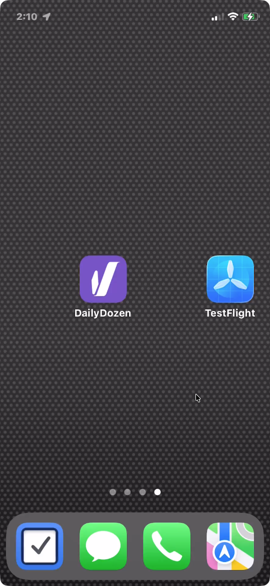
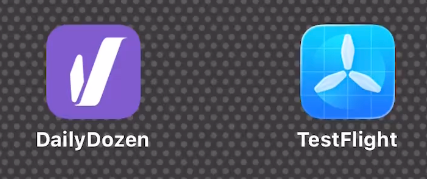
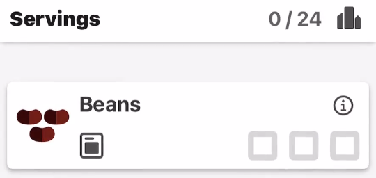
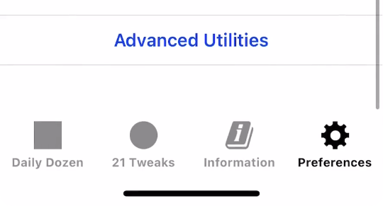
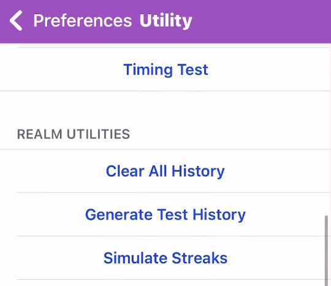
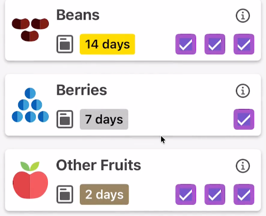
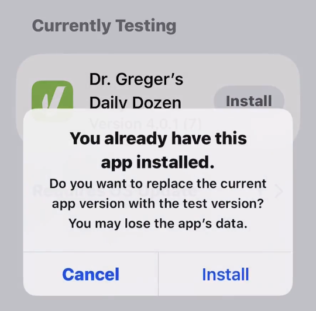
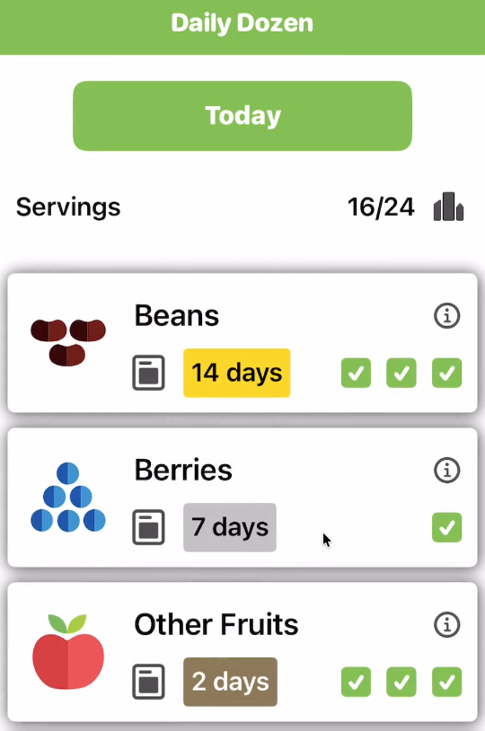
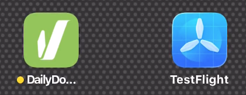

# Test Procedure Notes: v3 to v4 Install Launch

**Objective:** Check that user data and preferences are preserved when Daily Dozen v4.x installs over an existing Daily Dozen v3.x installation.

_Version 4.x is a major update that contains internal framework updates while maintaining the same user-facing functionality as version 3.5.3. Version 4.0.1 updates the Daily Dozen app to the latest Apple Swift frameworks and includes under-the-hood improvements._

_This is a high-level, end-to-end overall check._

### Top-Level Changes in v4.0.1

- Replaces all Storyboards with SwiftUI
- Replaces the third-party Charts library with Apple’s Charts framework
- Replaces the third-party Realm database with an SQLite database (part of Apple’s SDK)
- Enables and enforces Swift 6 strict concurrency
- [CocoaPods](https://github.com/CocoaPods/CocoaPods) (which is no longer receiving active development) is no longer used for Daily Dozen software development

### Video Overview

### Steps

#### Step 1. Install 'version_3_migration' branch app

Perform a clean install of the app build from the `version_3_migration` branch using Xcode. The `version_3_migration` app must be installed along with the Apple TestFlight app.

This `migration` v3 branch uses a distinct color scheme for clear differentiation from v4. See: [Docs/Thematic Elements - Dark Light Color](../Thematic%20Elements%20-%20Dark%20Light%20Color)

Verify that no data is present on a clean install.

#### Step 2. Generate version 3 data

Select **Advanced Utilities** on the Preferences tab.

In the Advanced Utilities view, select **Simulate Streaks** and tap OK.

Verify that the generated streaks data appear. Scroll down and review the data on both the **Daily Dozen** and **21 Tweaks** tabs. Also create a v3 TSV export for later comparison.

#### Step 3. Install DailyDozen v4 via TestFlight

Install Daily Dozen v4 via the Apple TestFlight app. Click **Install** to replace the current version (v3) with the new v4 version.

**Note:** The warning “You may lose that app’s data” is a key point of this test. The v3 data is expected to remain after the v4 installation. Click **Install**.

#### Step 4. Verify Data Migration

Verify that all generated streaks data migrated successfully. Scroll down and review the data on both the **Daily Dozen** and **21 Tweaks** tabs. Also create a v4 TSV export and compare it with the previously exported v3 TSV file.

Exit the Daily Dozen app. Verify that the Daily Dozen app icon is now green, possibly with a badge indicating "recently updated."

