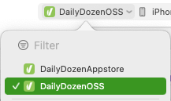
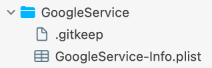
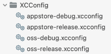
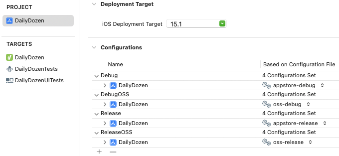
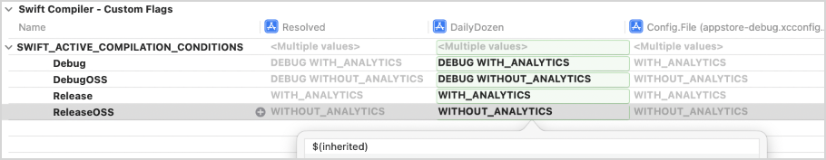

# DailyDozen Xcode Project Configurations

Contents: <a id="contents"></a>
[Open Source Software (OSS) Configuration](#open-source-software-oss-configuration-) •
[Apple App Store Configuration](#apple-app-store-configuration-) •
[Resources](#resources-)

## Open Source Software (OSS) Configuration <a id="open-source-software-oss-configuration-"></a><sup>[▴](#contents)</sup>

The `DailyDozenOSS` scheme is used to build an open source version of the DailyDozen iOS application.



> Note: _There is a `GoogleService-Info.plist` file used for opt-in analytics which is not being distributed for open source builds. The DailyDozenOSS scheme builds without the `GoogleService-Info.plist` file._

## Apple App Store Configuration <a id="apple-app-store-configuration-"></a><sup>[▴](#contents)</sup>


The `DailyDozenAppstore` scheme is used to build any version that is submitted to the Apple App Store for global distribution. This scheme requires the `GoogleService-Info.plist` file which is used for opt-in analytics.

The value `WITH_ANALYTICS` is added to the Swift build environment variable `SWIFT_ACTIVE_COMPILATION_CONDITIONS`. The `WITH_ANALYTICS` value is used by the related `#if` … `#endif` source code sections.

``` swift
#if WITH_ANALYTICS
// Google analytics related source code
#endif
```

**Below are the steps that were used to set up the `DailyDozenAppstore` project configuration:**

**Step 1. Reference Folder**

A `GoogleService` _blue reference folder_ was added to the project. The `GoogleService-Info.plist` file was moved into the reference folder. A `.gitkeep` file was added so that the `GoogleService` _reference folder_ is managed by `git` even if the _reference folder_ is empty.



**Step 2. Build Phase Script**

A build phase script named "Script: GoogleService" was added. This script moves the `GoogleService-Info.plist` file to the correct app bundle level, if the file is present.

_Script: GoogleService_

``` sh
echo "Script: GoogleService"

FILE_SOURCE="$BUILT_PRODUCTS_DIR/$WRAPPER_NAME/GoogleService/GoogleService-Info.plist"
FILE_TARGET="$BUILT_PRODUCTS_DIR/$WRAPPER_NAME/GoogleService-Info.plist"

if [ -f $FILE_SOURCE ]; then
   echo "FILE GoogleService-Info.plist is present."
   echo "SOURCE: $FILE_SOURCE"
   echo "TARGET: $FILE_TARGET"
   mv $FILE_SOURCE $FILE_TARGET
else
   echo "FILE GoogleService-Info.plist is not present."
fi
```

**Step 3. xcconf files**

Xcode configuration files `appstore-debug.xcconfig`, `appstore-release.xcconfig`, `oss-debug.xcconfig`, `oss-release.xcconfig` were added to the project.



The `.xcconfig` files were also used to document the build variable settings. The "which ones" and "why" could otherwise be obscured if only stated in the Xcode project windows.

``` ini
// Note:
//     `$(inherited)` was also added to SWIFT_ACTIVE_COMPILATION_CONDITIONS
//     at Targets > DailyDozen > Build Settings for Levels: DailyDozen target
SWIFT_ACTIVE_COMPILATION_CONDITIONS = WITH_ANALYTICS
```

**Step 4. Xcode Schemes**

The `.xcconf` were mapped to Xcode schemes named `DailyDozenAppstore` and `DailyDozenOSS`. 



**Step 5. Project Navigator Build Settings**

The `$(inherited)` value was manually added so that `.xcconfig` setting would propagate through the the "resolved" build setting level. 



**Step 6. Source Code**

The Xcode build process makes all `SWIFT_ACTIVE_COMPILATION_CONDITIONS` values available to pre-complile directives in the Swift source code.

Where applicable, the Google Firebase analytics was enabled via `#if WITH_ANALYTICS` in the Swift source code.

Below is an example use of `#if WITH_ANALYTICS`:

``` swift
#if WITH_ANALYTICS
Analytics.setAnalyticsCollectionEnabled(true)
UserDefaults.standard.set(true, forKey: SettingsKeys.analyticsIsEnabledPref)
logit.info("GoogleAnalyticsHelper doAnalyticsEnable() completed")
#else
logit.info("ANALYTICS is excluded from the build. (AnalyticsHelper doAnalyticsEnable)")
#endif
```

## Resources <a id="resources-"></a><sup>[▴](#contents)</sup>

_Documentation: Xcode Build System_

- [Configuring the build settings of a target](https://developer.apple.com/documentation/Xcode/configuring-the-build-settings-of-a-target)
- [Adding a build configuration file to your project](https://developer.apple.com/documentation/xcode/adding-a-build-configuration-file-to-your-project)
- [Build settings reference](https://developer.apple.com/documentation/xcode/build-settings-reference)
- [Running custom scripts during a build](https://developer.apple.com/documentation/xcode/running-custom-scripts-during-a-build)

_Tutorials_

- [2020.02.27 NSHipster: Xcode Build Configuration Files](https://nshipster.com/xcconfig/)

