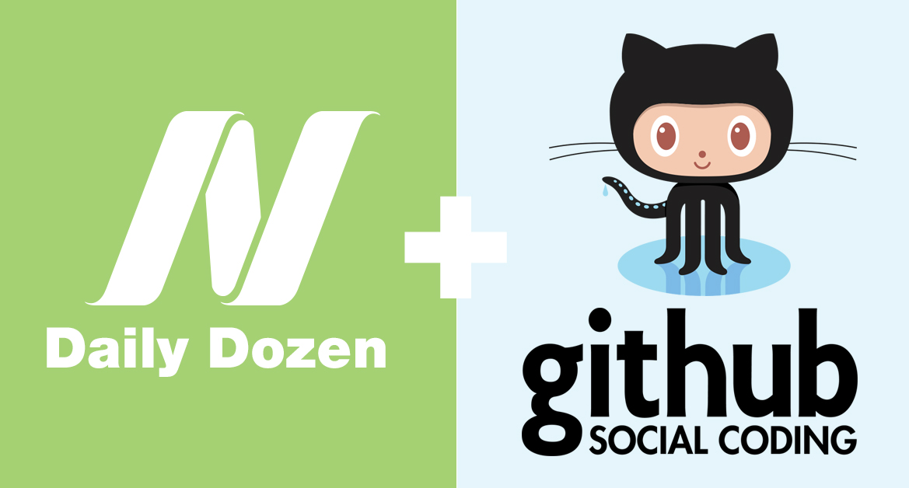
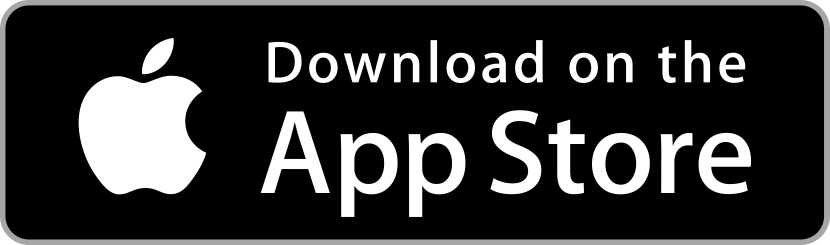

# Daily Dozen iOS App

## About

In the years of research required to create the more than a thousand evidence-based videos on [NutritionFacts.org][nutritionfacts.org], Michael Greger, MD, FACLM, has arrived at a list of what he considers the most important foods to include in a healthy daily diet. Yes, greens are good for you, but how much should we try to eat each day?

Dr. Greger’s Daily Dozen details the healthiest foods and how many servings of each we should try to check off every day. He explains his rationale in his book [How Not to Die][book]. All his proceeds from his books, DVDs, and speaking engagements is all donated to charity.

## Daily Dozen on the App Store

## Contribute

We would love for you to [contribute][contribute] and help make the Daily Dozen for iOS even better!

Check out our [Contribution Guidelines][contribute] for details on how to get started and our suggested best practices.

## Donate

To help support [NutritionFacts.org][nutritionfacts.org], click [here][donate]

## License

The Daily Dozen iOS App is licensed under the GPLv3

## [Contributors][contributors]

* [Marc Campbell][marc-medley]
* Konstantin Khokhlov <!-- [justaninja] page returns 404 not found -->
* [Will Webb][innerfish]
* [Christi Richards][christirichards]
* [Lauren Hacker][laurenhacker]

**Special thanks to the volunteer efforts of the original creators of the app:**

* **Application Development:** Chan Kruse
* **Application Design:** Allan Portera
* **Photography:** Sangeeta Kumar

## Updates

**3.2.21 (App Store: October 2, 2022)**

* Updated Spanish (es) translation.
    * Difference between the Android and iOS translation were resolved in the [daily-dozen-localization](https://github.com/nutritionfactsorg/daily-dozen-localization) repository. 
    * The common elements of the Android and iOS translations are now the same in the released app.
* Updated Russian (ru) translation.
* General software quality improvements. 

**3.2.11 (App Store: April 22, 2022)**

* Adds Catalan (ca), German (de), Hebrew (he), Polish (pl), Portuguese (pt-BR, pt-PT) and Russian (ru)

**3.2.9 (App Store: July 29, 2021)**

* Improved general support for language translations
* Improved layout for smaller screens
* Fixed case where days completed did not correctly display
* Updated topic link references to website

**3.2.5 (App Store: February 10, 2021)**

* Updated date picker interaction
* Fixed reminder notification
* Fixed issue where date navigation "Today" remains as yesterday's date

**3.2.3 (App Store: August 15, 2020)**

* Improved Spanish translation

_Note: Application level language selection via Settings, requires iOS 13 or newer._

**3.2.1 (App Store: July 7, 2020)**

* Restructured to support international localization in general
    * Instances of static English `String` replaced with localizable `NSLocalizedString`
    * Modified Storyboard UI layouts to adapt to string length variance of different languages. 
* Adds Spanish
* Improved data synchronization with HealthKit
* Fixed update between Weight checkbox and Weight entry to match on the display
* Fixed weight chart x-axis scaling

**3.1.0 (App Store: December 17, 2019)**

* Adds 21 Tweaks
* Adds Weight Tracking with Health Kit Integration
* Add Application Tab Controller bar

Improvements:

* Adds settings control to choice between using "Daily Dozen only" or "Daily Dozen + 21 Tweaks".

* Adds settings control to select whether to use Imperial or Metric type units throughout the app.

**2.0.0 (App Store: March 9, 2018)**

* Brand new design
* Daily Dozen tracking now persists over multiple days
* Visualize your progress over time with our new Charts integration
* Enable a daily reminder with a custom time setting in the Daily Reminder Settings
* Backup your data to your files
* Added additional links in the main menu including The Daily Dozen Cookbook
* Updated About information in the main menu

**1.0.2 (App Store: November 13, 2017)**

* Misspelling fix

**1.0.0 (App Store: December 21, 2015)**

* Initial Release

[nutritionfacts.org]:http://nutritionfacts.org "NutritionFacts.org - The Latest in Nutrition Research"
[contribute]:CONTRIBUTING.md "Contribute to the Daily Dozen iOS App"
[contributors]:https://github.com/nutritionfactsorg/daily-dozen-ios/graphs/contributors
[donate]:https://nutritionfacts.org/donate "Donate to NutritionFacts.org"
[book]:http://nutritionfacts.org/book "How Not to Die"
[christirichards]:http://github.com/christirichards "Christi Richards on GitHub"
[innerfish]:https://github.com/innerfish "Will Webb on Github"
[justaninja]:https://github.com/justaninja "Konstantin Khokhlov on Github"
[laurenhacker]:http://github.com/lahacker "Lauren Hacker on Github"
[marc-medley]:http://github.com/marc-medley "Marc Campbell on Github"
